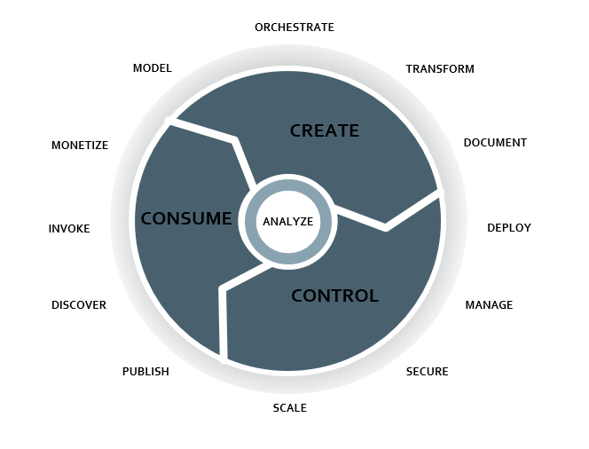
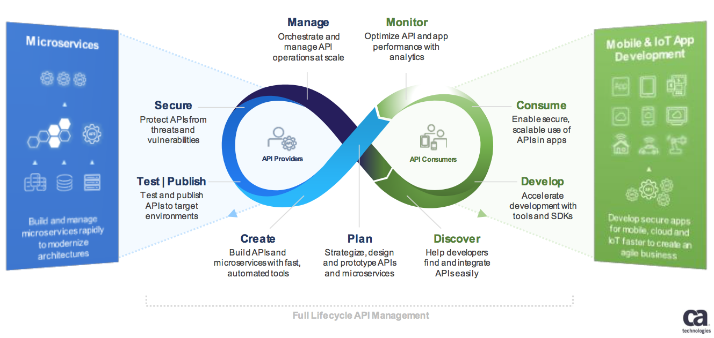

# API Management

## Full Life Cycle API Management

The API Lifecycle Management approach provides a holistic view on how to manage the different stages in the life of an API, from creation to retirement.

The API Lifecycle Management diagram below represents a detailed view of the steps in the life of an API, which we will talk more about below.

### API Creation stage

#### Model
* Visually or programmatically specify the data needed for your API endpoints.
* Let’s assume you have an existing database that contains data you want to expose with APIs. Thanks to connectors, you can easily expose the data model and define your own API format.
* The same applies to SaaS applications which APIs you can connect to with connectors to turn them into your own API format.

#### Orchestrate
* Combine and normalize data from multiple sources.
* You might want to expose an API that combines information from different underlying APIs. With the orchestration ability, you can do this easily, both in a synchronous or asynchronous way.

#### Transform
* Convert legacy formats (e.g. XML) to modern consumable formats (e.g. JSON).
* When it comes to connecting to the internal systems, such as the ESB, there are still many internal SOAP Web Services (XML) that need to be exposed into REST APIs (JSON) for easier consumption by digital apps. A Visual Mapper allowing easy and graphical conversion between those two formats is an important tool to have.

#### Document
* Auto-generate docs and code-snippets for models and API operations.
* API Documentation is key for developers to manipulate them easily. But this is also a very tedious, boring and error-prone task. Having a tool that generates API documentation automatically is a big pain reliever.

### API Control stage

#### Deploy
* Instantly deploy APIs to the target environment with zero setup effort.
* In a digital world, the time between code delivery and deployment need to be as short as possible. DevOps tools accelerate this with Continuous Integration and Continuous Delivery. To manage your APIs, you need a solution that integrates very well into your DevOps strategy. For smaller projects, you even need a solution that comes with an elastic runtime you can deploy to with just a single click.

#### Manage
* Manage access to the API and protect the quality of service via rate limiting and SLAs.
* The more APIs you have, the more unmanageable they get. You will feel very quickly the need for an API Catalog you can browse easily and where you can manage the publication state of your APIs (unpublished/published/deprecated/retired) and their versioning. The API Catalog should also contain rate-limiting settings (to protect your internal systems against high traffic peaks coming from API usage) and SLA enforcement.

#### Secure
* Establish and enforce enterprise policies for security and firewalling APIs.
* As APIs are a door to the world, securing them is paramount. You need an API Management solution that offers top-notch API security.
* Security certification such as Common Criteria is also strongly recommended.

#### Scale
* Auto-scale infrastructure up or down to run your server-side apps.
* The Web traffic is unpredictable and very variable. You need an infrastructure that adjusts automatically with the traffic, with no manual intervention needed.

### API Consumption stage

#### Publish
* Market to internal groups, partners, or the general public via a central API Catalog.
* APIs from the API Catalog is published into an API Developer Portal to be easily consumed by developers.
* There are three types of APIs, requiring different settings for your API Portal:
    * Private APIs – the ones for internal use only
    * Partner APIs – the ones for a specific set of partners only
    * Public APIs (aka Open APIs) – the ones available to anyone.
* Those API types need to be managed differently, for example, partner APIs must require you to have a partner onboarding process in the solution.
* The marketing aspect shouldn’t be neglected. An Open API Portal will need an attractive branding and also promoted through the different marketing channels.

#### Discover
* Self-service access for developers to browse APIs, their attributes, and documentation.
* The API Portal is aimed to be available in self-service. Developers should be able to connect 24/7 and experience smooth navigation with documentation, Q&A and support widget if help is needed.
* Before using an API, developers prefer to test it first, so your API Portal should offer an easy try-it feature.

#### Invoke
* Execute API operations or out-of-the-box MBaaS services from a client app.
* To use APIs, developers get an automatically generated from the API developer portal and can then integrate those APIs into their code with the help of an API SDK for their favorite development language.
* To accelerate your mobile app development, out-of-the-box MBaaS services are great to have available in your API Portal.

#### Monetize
* Track utilization and apply rate plan policy to generate API revenue.
* API monetization is a complex topic. Most of the time, APIs are offered for free because they represent a new way of making business and the business value doesn’t reside in the API itself, but in what it represents in terms of larger outreach and new market share.
* But sometimes, companies might want to monetize their APIs because their underlying data are part of their business. A good example is the Data as a Service Dun & Bradstreet project using the Axway API Management solution.

### API Analytics
* You can see on the API Lifecycle Management diagram above a circle in the middle named “Analyze.” This position in the middle means that API Analytics is paramount across the full API Lifecycle Management.
* Why? Simply because you can’t control nor improve what you can’t measure.
* Embedded Analytics for API Management is a must-have when you want to manage your growing number of APIs.

|  |
|:--:| 
| *Axway API Lifecycle Management Diagram* |

|  |
|:--:| 
| *CA Full Lyfecycle API Management* |

## API Management Solution Components
* API Creation Tool
* API Gateway
* API Catalog
* API Client Registry
* API Developer Portal
* API Monitoring
* API Analytics

### The API Catalog
This is the central API Management solution component. It contains in one place all available APIs–both REST and SOAP. To know more, check out this article on what is an API Catalog.
* Import and export common API definition formats such as Swagger, RAML. WADL, and WSDL for an API-first approach
* Connectivity to third-party API Catalogs
* Easy API search and discovery
* Support for all API lifecycle stages, from registration through retirement
* Support for API products to bundle multiple APIs into the same product
* REST API security and Web Service security thanks to multiple data security options that dramatically reduce the time to implement a high level of security designed to avoid breaches. Check out this API security video to learn more.
* API quota enforcement
* Simple or more advanced API monetization mechanisms.

### The API Client registry
In addition to your API Catalog, you need an API Client registry, another API Management solution component. What is it? This is a component that extends your API catalog and contains the list of consumers and permissions of all APIs. Advanced API Management solutions often offer the API Client Registry as part of the same product as the API Catalog.

* Defining default API access: public, restricted or private.
* **Organization registry** for B2B use cases
* **Application registry**: list of applications that can access a specific set of APIs
* **App developer registr**y to give them access to the API developer portal to manage their API access, keys and traffic themselves.

### The API Developer Portal
The API developer portal boosts adoption by making it easy for developers to join an API community and discover, consume, build and test APIs. It’s a key API Management solution component when you want to run an external developer program to boost innovation and foster co-creation. The API developer Portal can also be used internally to drive the adoption of APIs.

It’s often built on a standards-based CMS portal with search/read/try/use API discovery and FAQs, articles and forums for building developer communities.

* Multiple onboarding mechanisms
* Advanced search and documentation to easily browse large catalogs.
* Mobile SDK available to easily integrate APIs into your favorite programming language
* Connectivity to enterprise identity providers
To know more, check out this article on the key features of an API developer portal.

### The API Gateway
The API Gateway is the core API Management solution component. It is a secured Gateway that proxies the API traffic. Quite often it is deployed in the DMZ for security reasons. It secures, checks and controls all API calls. With help of the API Policy Editor below, it offers integration services that free the data and services trapped in back-office silos with the security you expect in an enterprise solution.

The API Gateway can also be deployed in the internal network to act as an API composition layer. In advanced architecture scenarios, there can even be three API layers:

* A layer in the DMZ for API security
* Two layers in the LAN, one for business API composition and one for technical API composition. Technical APIs are exposing legacy services and are then consumed by business APIs via business integration policies.

This is extremely important to select a scalable API Gateway that can smoothly accept and route very large volumes of traffic with no impact on performance.

As the market is moving towards microservice adoption, we see more and more micro-gateways that come either as a replacement or as an additional module to the legacy API Gateway.

### The API Creation Tool
The API Creation Tool is a very useful API Management solution component to address the needs of the digital development teams. While the API Policy Editor is very good for integration teams to turn legacy systems into APIs and contains hundreds of filters to accelerate integration with the enterprise applications, the API Creation Tool is much lighter and is dedicated to the “digital world” development.

* Facilitated API creation out of modern SaaS applications and data sources. It allows it to compose mobile-ready APIs visually or programmatically.
    * Available SaaS connectors to facilitate integration
    * Definition of the app data model without writing any code
    * Automatic documentation generation
* Combining multiple APIs into optimized APIs–aka API orchestration–to split incoming API calls into multiple underlying API calls. Leading API Management solutions offers an online Graphical Editor to facilitate such an API orchestration.
* Leveraging the enterprise APIs created with the API Policy Editor, combining them with 3rd party APIs and providing optimized developer-facing APIs.

Meshing up APIs from internal systems and external providers is the new challenges for companies who realize that the additional value resides in combining their own information and service with the ones from their partners, suppliers, customers. This paradigm is called the Mesh App and Service Architecture–aka masa mesh–and contributes building a Customer Experience Network.

Those new APIs also compose the microservices of those distributed architectures, as there are needs for different sizes of microservices depending on the location on the architecture and their use cases in terms of reusability.

### The API monitoring and analytics component

API monitoring & analytics provide the ability to measure and monitor success with visibility across the digital business value chain. You can’t measure what you can’t control, this API Management solution component is paramount for the success of your API program.

A complete API monitoring and analytics solution should provide real-time analytics with those capabilities:

* **Operational metrics**: real-time, end-to-end visibility of API usage.
* **Developer metrics**: API consumer adoption metrics with visibility to top consumers, churn risk and quota status. They are important to understanding API program business success.
* **API usage metrics**: measure most and least popular, volume, traffic and TPS.
* **API performance metrics**: API quality metrics with latency and error rates.
* **API infrastructure metrics**: analysis of resource bottlenecks, error rates and latency.
* **Traffic monitoring**: monitor and troubleshoot individual transactions, including drilling into processing steps and message content to perform root-cause analysis.
Mobile metrics
* **Predictive analytics**: they are important for the proactive identification of abnormal situations and key operational insight for decision-making.

Those dashboards can be developed with help of external solutions but we recommend to use best of breed dashboards that are often proposed as Embedded Analytics in API management solutions and meet the needs of the multiple stakeholders who are part of your API program.

As you can see, a full-fledged API Management solution doesn’t contain just one or two components but quite many. Leading API Management vendors such as Axway offer the whole suite, while other vendors only offer a subset of it.

## API Management - The Five Stages of API Adoption

### Stage 1: API Awareness
In the first stage of API adoption, APIs get simply introduced as a lightweight method of application integration. Oftentimes, we see integration needs of mobile applications as the first targets. In a mobile-first approach, APIs are simply extracted from the User Experience Design – or: Human Interface Design, as Apple still prefers to call it. In other words, APIs are designed to make life simple for app developers. And because the web-centric model of APIs tends to resonate well with the development frameworks for mobile apps, the threshold to adopt APIs is quite low. In this stage, expect your developers to quickly become enthusiastic – the new, simplistic programming model for remote procedure calls proves way much easier to implement than the technologies they’re used to. Moreover, the developers feel in control over the entire integration pathway, which greatly increases the development efficiency. It significantly speeds-up the overall process, which in turn makes product owners happy. And so, the infections quickly spread – especially to the teams working in the fast-paced mode of IT. 

### Stage 2: API Platform Architecture

Once the benefits of APIs are firmly established, you’re likely to start thinking about different kind of concerns - if only because certain vendors are pushing their API technologies. The concerns that typically get entered on the management agenda in this stage are the ones such as: the risks involved with API usage, how to control the quality of your APIs, and how to manage those APIs on the enterprise scale.

API Management products tackle these concerns through multiple components. An API Gateway is the technology of choice to guard the access to your APIs. It acts as an application-level proxy which enforces a set of policies. These policies address several risks involved – such as the limitation of access and the protection against capacity overflow. The first set of policies grants access only from identified applications, developed by trusted developers, who can prove they own a valid subscription to your API. Additionally, end-user authorization might come into play. After all, not everybody using an application gets treated the same. Rate limitation is a different kind of technique, aiming to limit client applications to a reasonable amount of API invocations per unit of time. Any subsequent invocation request gets throttled out. Additionally, more intelligent rate-limiting policies may limit the total number of invocations from all sources combined. After all, is protection of your back-end systems against an overflow of API invocations your target, then that is the most straightforward approach.

To make this all work, policies should be defined (at a Policy Administration Point) and published, and API subscriptions must be managed. That’s where an API Publishing Portal and an API Developer Store come into play. It makes a lot of sense to implement a single store for all the APIs on offer. Developers who consume APIs will be thankful if they have a single point to discover, test, and subscribe to your APIs.

Setting up a system of gateways and portals can be very straightforward. Oftentimes, however, all kinds of requirements must be taken into consideration. Think of performance, (global) scalability, availability, manageability and security requirements, to name a few. The API management components must be fitted into an existing enterprise architecture, including an identity provider, an RDBMS, an analytics engine, a log aggregator and a health monitor. And if you have multiple data-centers, in the cloud or on premise, the degree of freedom to choose increases proportionally. You get the idea. So, it is probably best to plan for several design workshops with your leading architects.

With centralized API Management comes the first effort of standardization - most notably naming conventions and life-cycle management policies. Of course, the importance of creating the outside image of a well-managed and synchronized enterprise varies from company to company, and with it the richness and enforcement of standards, but few can avoid having some standards in place at all.

### Stage 3: API Management Core Processes

An approach we experience most of the times, is to start with adopting much of the API Management functionality out-of-the-box – the minimum viable API Management configuration – and only later start with scaling, customization, and fine-tuning efforts. These changes will not affect your overall architecture, but it may, for instance, impact the look-and-feel, and even the functionality of your portals. 

Developer engagement starts to get more and more attention. For instance, to promote the collaboration of API providers and consumers across time, language and geographical boundaries. What are best-practices for documentation? How to classify APIs? How to build and maintain consistency across APIs? Finding the right answers to those questions is often a complicated puzzle to solve.

Another area of concern are the management processes supporting developers in your developer store. Out-of-the-box, those processes are simply self-managed by the developer. In certain cases, this may be good enough. More often, we find that the businesses or business units offering their APIs want to have some control over the developers who implement them. This may range from simply verifying an email address, where perhaps all addresses outside the company domain get filtered out, to an extensive vetting of developers and their organizations, up to a thorough investigation of the applications they develop. 

WSO2 API Manager allows you to completely define your own processes, in your preferred workflow, business process management or case management system. And if you don’t have such a system available, or you don’t want to invest in it anymore, rest assured the WSO2 Business Process Server is a great choice to do that job for you.

### Stage 4: Advanced API Management Practices

Over time, the number of APIs you manage, the number of developers you engage with, and the number of API invocations you’re faced with, are all on the rise. That’s good, your business is thriving.

To keep up with your growing business, you’re depending more and more on your API Analytics dashboard. You want to discover your bottlenecks early, and preferably fix them as and when they occur. Instant up- and downscaling of your API gateways is an increasingly common approach. The good news is that your advanced API Analytics is the ideal system to monitor the health of your system, and initiate up- and downscaling events. Moreover, it can also monitor - be it intentional or not - undesirable usage of your APIs - and initiate a proper counter-action - dynamically limiting rates per developer, per application, or IP address, for instance. Or even revoking an API subscription, or blacklisting an IP address altogether. You’re in charge of your platform, and the good thing is that you don’t have to intervene personally when your policies are violated.

Frankly, the way these advanced counter-policies are developed are mostly as a follow-up on some kind of incident. That resonates nicely with our recommended practice: do not spend too much time in dreaming up nightmare scenario’s, but rather monitor your systems closely and aggressively evaluate and follow-up any incident, such that there is a zero chance of repeat. In other words: move fast, and repair anything that breaks along the way. And don’t miss any opportunity to learn and enhance. 

Monetization is another theme that comes with more experienced API enterprises. With monetization of your APIs, intimate developer engagement grows in importance even more. Your API Developer store has now become a portal to seduce more customers, and to keep them happy over time. Hence, you want to share statistics on their API consumption, and on your service levels. And most important of all, you want to meter usage data in accordance to your billing plan. WSO2 API Manager Analytics is there to help you out.

### Stage 5: API First

In the fifth and currently final stage, enterprises come to the realization that what works well for the front-end integration, could work equally well in back-end integration. The traditional SOA integration effort tends to get discharged as unnecessarily cumbersome, disappointingly ineffective, and insufficiently aligned with today’s agile development practices. So, APIs become the core language of enterprise integration.

To adopt an API First strategy, a couple of things need to be in place. First, your API gateway must become the single-point-of-entry to your services. Only then can you trust your policy enforcement point to effectively shield your services form policy violation in all cases. No more excuses, all service calls are routed over your API gateway. And all service invocations are actively monitored and subject to managed policies. No exception.

Secondly, your integration approach must be turned upside-down. Your service consumer teams have no longer to wait for the integration squad to do their magic – mostly to discover in the end, that the service interface leaves much to be desired after all. In an API first approach, you start with defining your API first, and simply generate your stubs and clients so your teams can immediately start experimenting and enhancing. And only when you’re certain that an API is well-defined, then you start building your service providers and your service consumers. You can do that in parallel, because the integration has already been validated and verified. In terms of efficiency gains, this is probably the greatest boost you can expect from your API management initiative.

## REST API Security Essentials

Security isn’t an afterthought. It has to be an integral part of any development project and also for REST APIs. There are multiple ways to secure a RESTful API e.g. basic auth, OAuth etc. but one thing is sure that RESTful APIs should be stateless – so request authentication/authorization should not depend on cookies or sessions. Instead, each API request should come with some sort authentication credentials which must be validated on the server for each and every request.

### REST Security Design Principles

The paper “The Protection of Information in Computer Systems” by Jerome Saltzer and Michael Schroeder, put forth eight design principles for securing information in computer systems, as described in the following sections:

1. **Least Privilege**: An entity should only have the required set of permissions to perform the actions for which they are authorized, and no more. Permissions can be added as needed and should be revoked when no longer in use.

2. **Fail-Safe Defaults**: A user’s default access level to any resource in the system should be “denied” unless they’ve been granted a “permit” explicitly.

3. **Economy of Mechanism**: The design should be as simple as possible. All the component interfaces and the interactions between them should be simple enough to understand.

4. **Complete Mediation**: A system should validate access rights to all its resources to ensure that they’re allowed and should not rely on the cached permission matrix. If the access level to a given resource is being revoked, but that isn’t reflected in the permission matrix, it would violate the security.

5. **Open Design**: This principle highlights the importance of building a system in an open manner—with no secret, confidential algorithms.

6. **Separation of Privilege**: Granting permissions to an entity should not be purely based on a single condition, a combination of conditions based on the type of resource is a better idea.

6. **Least Common Mechanism**: It concerns the risk of sharing state among different components. If one can corrupt the shared state, it can then corrupt all the other components that depend on it.

7. **Psychological Acceptability**: It states that security mechanisms should not make the resource more difficult to access than if the security mechanisms were not present. In short, security should not make worse the user experience.

### Best Practices to Secure REST APIs

Below given points may serve as a checklist for designing the security mechanism for REST APIs.

#### Keep it Simple
Secure an API/System – just how secure it needs to be. Every time you make the solution more complex “unnecessarily,” you are also likely to leave a hole.

#### Always Use HTTPS
By always using SSL, the authentication credentials can be simplified to a randomly generated access token that is delivered in the username field of HTTP Basic Auth. It’s relatively simple to use, and you get a lot of security features for free.

If you use HTTP 2, to improve performance – you can even send multiple requests over a single connection, that way you avoid the complete TCP and SSL handshake overhead on later requests.

#### Use Password Hash
Passwords must always be hashed to protect the system (or minimize the damage) even if it is compromised in some hacking attempts. There are many such hashing algorithms which can prove really effective for password security e.g. PBKDF2, bcrypt and scrypt algorithms.

#### Never expose information on URLs
Usernames, passwords, session tokens, and API keys should not appear in the URL, as this can be captured in web server logs, which makes them easily exploitable.
```
https://api.domain.com/user-management/users/{id}/someAction?apiKey=abcd123456789  //Very BAD !!
```

The above URL exposes the API key. So, never use this form of security.

#### Consider OAuth
Though basic auth is good enough for most of the APIs and if implemented correctly, it’s secure as well – yet you may want to consider OAuth as well. The OAuth 2.0 authorization framework enables a third-party application to obtain limited access to an HTTP service, either on behalf of a resource owner by orchestrating an approval interaction between the resource owner and the HTTP service, or by allowing the third-party application to obtain access on its own behalf.

#### Consider Adding Timestamp in Request
Along with other request parameters, you may add a request timestamp as an HTTP custom header in API requests. The server will compare the current timestamp to the request timestamp and only accepts the request if it is within a reasonable timeframe (1-2 minutes, perhaps).

This will prevent very basic replay attacks from people who are trying to brute force your system without changing this timestamp.

#### Input Parameter Validation
Validate request parameters on the very first step, before it reaches to application logic. Put strong validation checks and reject the request immediately if validation fails. In API response, send relevant error messages and example of correct input format to improve user experience.